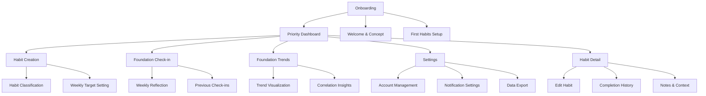
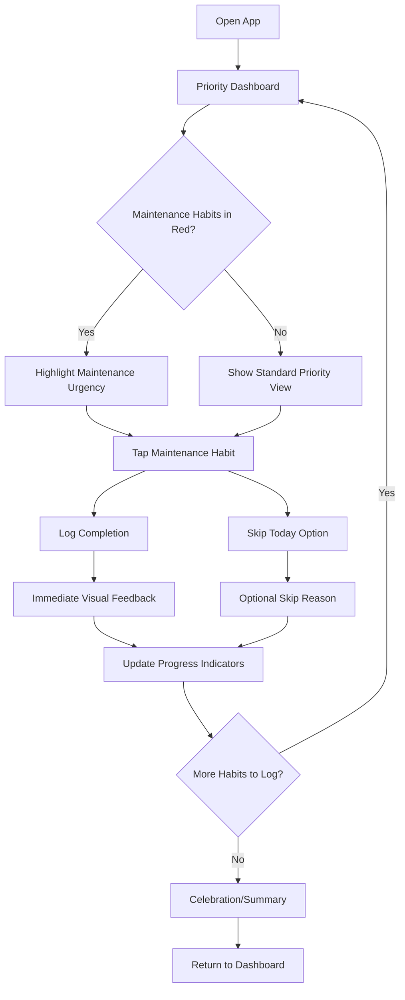
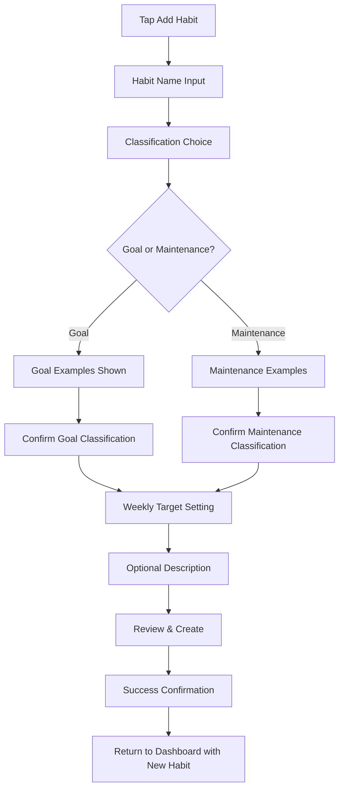
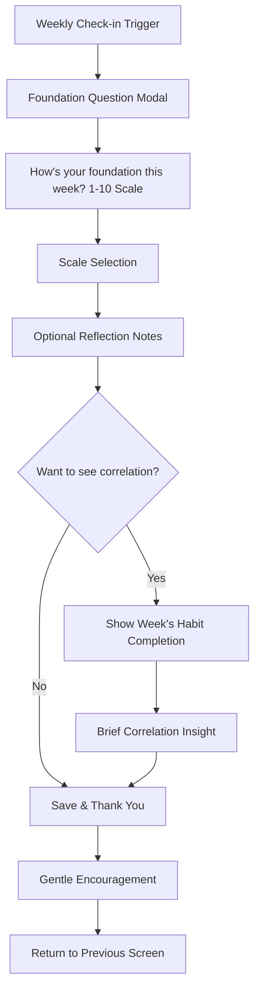
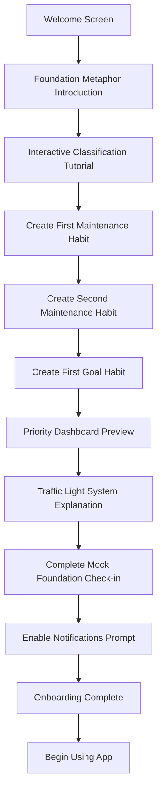

# FoundationFirst UI/UX Specification

**Document Date:** 2025-08-22  
**Author:** Sally (UX Expert)  
**Version:** 1.0  

## Introduction

This document defines the user experience goals, information architecture, user flows, and visual design specifications for FoundationFirst's user interface. It serves as the foundation for visual design and frontend development, ensuring a cohesive and user-centered experience.

### Overall UX Goals & Principles

#### Target User Personas

**Achievement-Oriented Burnout Recoverers:** Professionals (25-45) who have experienced goal-pursuit burnout and seek sustainable approaches. They need visual clarity to avoid overwhelm, gentle guidance rather than demanding interfaces, and clear progress indicators that don't create additional pressure. Previous habit app abandonment suggests they need immediate value and low cognitive load.

**Wellness-First Goal Adopters:** Established wellness practitioners (30-50) who want to add structured goal achievement. They value calm, mindful interfaces that respect their wellness-first philosophy. They need integration between spiritual/wellness practices and practical goal tracking, with design language that feels supportive rather than productivity-driven.

#### Usability Goals

- **Immediate Comprehension:** Users understand maintenance-first prioritization within first app interaction without explanation
- **Effortless Logging:** Habit completion requires single tap with clear visual feedback, completing in under 2 seconds
- **Sustained Engagement:** Interface supports daily use without fatigue through calming design patterns and progressive disclosure
- **Foundation Clarity:** Users can quickly identify which habits need attention through traffic light urgency system
- **Gentle Guidance:** Educational elements teach maintenance-first concept without feeling preachy or overwhelming

#### Design Principles

1. **Foundation-First Visual Hierarchy** - Maintenance habits always prominently positioned, using visual weight to reinforce priority without hiding goals
2. **Calming Productivity** - Wellness-focused aesthetics over aggressive productivity patterns, using natural colors and gentle feedback
3. **Progressive Empowerment** - Start with simple logging, gradually reveal deeper features as users demonstrate engagement
4. **Inclusive by Design** - WCAG AA compliance and consideration for users with disabilities, stress, or attention challenges
5. **Contextual Education** - Teach concepts through interaction and visual design rather than lengthy explanations

#### Change Log

| Date | Version | Description | Author |
|------|---------|-------------|--------|
| 2025-08-22 | 1.0 | Initial front-end specification creation from PRD | Sally (UX Expert) |

## Information Architecture (IA)

### Site Map / Screen Inventory

### Navigation Structure

**Primary Navigation:** Tab bar at bottom with 4 core sections: Today (Priority Dashboard), Foundation (Health trends and check-ins), Add Habit (prominent center position), and Profile/Settings. Today tab is default home, emphasizing daily habit focus.

**Secondary Navigation:** Within-screen navigation using cards, lists, and modal presentations. Header navigation for detailed views (habit editing, trends analysis) with clear back navigation. Foundation check-in accessed via floating action button or weekly notification.

**Breadcrumb Strategy:** Not applicable for mobile app - using clear screen titles and back navigation instead. Each screen has contextual header showing current location and primary action.

## User Flows

### Daily Habit Logging Flow

**User Goal:** Complete daily habits efficiently while understanding priority through maintenance-first ordering

**Entry Points:** App launch to priority dashboard, daily notification, habit reminder notification

**Success Criteria:** User completes habit logging in under 30 seconds, understands which habits need attention, feels motivated rather than pressured

#### Flow Diagram

#### Edge Cases & Error Handling:
- **Offline logging:** Habits logged offline show pending sync indicator, sync when connection restored
- **Accidental completion:** Easy undo within 5 seconds of logging
- **Missed days:** Previous days accessible via calendar view, no guilt-inducing language
- **Empty habit list:** Gentle prompt to create first habit with maintenance-first guidance

**Notes:** Flow emphasizes maintenance habits visually and functionally while avoiding pressure or guilt. Celebration moments reinforce positive behavior without being overwhelming.

### Habit Creation Flow

**User Goal:** Create new habit with appropriate classification understanding goal vs maintenance distinction

**Entry Points:** Add habit button on dashboard, onboarding process, empty state prompt

**Success Criteria:** User successfully creates habit with correct classification, understands maintenance-first philosophy, sets appropriate weekly targets

#### Flow Diagram

#### Edge Cases & Error Handling:
- **Unclear classification:** Interactive examples and "Not sure?" helper options
- **Duplicate habit names:** Gentle suggestion to modify or merge with existing
- **Overwhelming target setting:** Smart defaults based on classification type
- **Classification mistakes:** Easy editing from habit detail view

**Notes:** Educational without being preachy, using examples relevant to target user personas. Classification choice is prominent but not intimidating.

### Foundation Health Check-in Flow

**User Goal:** Complete weekly foundation health reflection quickly and meaningfully

**Entry Points:** Sunday evening notification, foundation trends screen, manual trigger from dashboard

**Success Criteria:** User completes check-in in under 2 minutes, finds the process valuable for self-reflection, engages consistently over time

#### Flow Diagram

#### Edge Cases & Error Handling:
- **Missed check-ins:** Accessible through trends screen with gentle reminder language
- **Scale confusion:** Clear labels and examples for 1-10 meaning
- **Interruption during check-in:** Auto-save draft, resume later option
- **Long gaps between check-ins:** Welcome back messaging without guilt

**Notes:** Modal presentation maintains focus, correlation insights reinforce maintenance-first value proposition without being pushy.

### New User Onboarding Flow

**User Goal:** Understand FoundationFirst concept and create initial habits to begin using the app effectively

**Entry Points:** First app launch, account creation completion

**Success Criteria:** User creates 3-5 habits with appropriate classifications, understands priority dashboard, completes first foundation check-in

#### Flow Diagram

#### Edge Cases & Error Handling:
- **Onboarding abandonment:** Resume from last completed step
- **Concept confusion:** Skip buttons with "Learn as you go" option
- **Habit creation blocks:** Pre-written suggestions users can customize
- **Notification denial:** Alternative reminder strategies offered

**Notes:** Learning through interaction rather than passive reading, with clear progress indicators and easy escape hatches for users who want to explore independently.

## Wireframes & Mockups

### Design Files

**Primary Design Files:** TBD - Recommend Figma for React Native design system creation with component specifications and developer handoff capabilities.

### Key Screen Layouts

#### Priority Dashboard (Main Screen)

**Purpose:** Central hub that reinforces maintenance-first philosophy through visual hierarchy while providing efficient habit logging

**Key Elements:**
- **Header Section:** Welcome message, current date, foundation health indicator (small)
- **Maintenance Habits Section:** Visually elevated card design, traffic light urgency borders, large tap targets for completion
- **Goal Habits Section:** Secondary visual treatment, clear separation from maintenance section
- **Floating Add Button:** Prominent circular FAB for quick habit creation access
- **Bottom Navigation:** Today (current), Foundation, Add (center), Profile tabs

**Interaction Notes:** Maintenance habits always appear first regardless of completion status. Traffic light borders (red/yellow/green) indicate weekly progress urgency. Single tap completion with immediate visual feedback and subtle animation.

**Design File Reference:** [Dashboard-Main-View] - to be created in Figma

#### Habit Creation Flow

**Purpose:** Guide users through habit classification with clear examples while avoiding overwhelming educational content

**Key Elements:**
- **Progressive Steps:** Name input → Classification choice → Target setting → Confirmation
- **Classification Cards:** Side-by-side "Goal" and "Maintenance" options with visual examples
- **Smart Examples:** Context-aware suggestions based on common patterns for each type
- **Help Text:** Contextual, collapsible explanations without cluttering interface
- **Progress Indicator:** Clear steps showing current position in flow

**Interaction Notes:** Classification choice uses large, accessible cards with visual examples. Smart defaults for weekly targets based on habit type. Easy back navigation and draft saving.

**Design File Reference:** [Habit-Creation-Flow] - multi-step form designs needed

#### Foundation Health Check-in Modal

**Purpose:** Focused weekly reflection interface that feels meaningful rather than burdensome

**Key Elements:**
- **Centered Modal:** Semi-transparent overlay focusing attention on check-in
- **Scale Selector:** 1-10 visual scale with clear endpoints (Struggling → Thriving)
- **Optional Notes:** Expandable text area for reflection without requirement
- **Correlation Hint:** Small preview of week's habit completion if user is interested
- **Gentle Close:** Easy dismissal with "Remind me later" option

**Interaction Notes:** Modal presentation prevents distraction, scale uses large touch targets with clear visual feedback. Optional elements don't interrupt flow for quick users.

**Design File Reference:** [Foundation-Checkin-Modal] - focused modal design needed

#### Onboarding Tutorial Screens

**Purpose:** Teach maintenance-first concept through interactive habit creation rather than passive explanation

**Key Elements:**
- **Welcome Screen:** Foundation metaphor illustration with simple, friendly copy
- **Interactive Tutorial:** Real habit creation with guided classification choices
- **Progress Dots:** Clear indication of onboarding steps remaining
- **Skip Options:** Accessible but not prominent for users who prefer exploration
- **Sample Dashboard:** Preview of priority dashboard with tutorial habits

**Interaction Notes:** Learning through doing - users create actual habits during onboarding. Each step builds understanding of maintenance-first concept progressively.

**Design File Reference:** [Onboarding-Sequence] - full tutorial flow designs needed

#### Foundation Trends Screen

**Purpose:** Visualize foundation health over time with correlation insights to reinforce maintenance-first value

**Key Elements:**
- **Line Chart:** 12-week foundation health score trend with current week highlighted
- **Correlation Cards:** Visual hints showing high maintenance completion weeks vs foundation scores
- **Data Point Details:** Tap to reveal week details including habits and notes
- **Empty State:** Encouraging message for new users with few data points
- **Navigation Header:** Clear title and back button for secondary screen

**Interaction Notes:** Chart designed for mobile touch interaction with appropriate spacing. Correlation insights presented as discovery rather than explicit instruction.

**Design File Reference:** [Foundation-Trends-Chart] - mobile chart design with touch interactions

## Component Library / Design System

### Design System Approach

**Design System Approach:** Create new custom design system specifically for FoundationFirst's wellness-focused, foundation-first philosophy. While leveraging React Native's built-in components for performance, we'll create custom styling and behavior patterns that reinforce maintenance-first prioritization and gentle, supportive user experience.

### Core Components

#### HabitCard

**Purpose:** Primary interface element for habit display and interaction, supporting maintenance-first visual hierarchy

**Variants:** 
- **Maintenance Card:** Elevated visual treatment with foundation-themed styling
- **Goal Card:** Secondary visual treatment clearly differentiated from maintenance
- **Completed Card:** Subtle check state with celebration micro-animation
- **Urgent Card:** Enhanced traffic light border treatment for behind-schedule habits

**States:** Default, Pressed, Completed, Urgent (Red/Yellow/Green), Disabled, Loading

**Usage Guidelines:** Maintenance cards always use elevated styling regardless of completion status. Traffic light urgency borders take precedence over other visual states. Maintain minimum 44pt touch target for accessibility.

#### ClassificationSelector

**Purpose:** Educational component for habit creation that teaches goal vs maintenance distinction

**Variants:**
- **Side-by-Side Cards:** Equal-sized options for classification choice
- **Selected State:** Clear visual feedback for chosen classification
- **With Examples:** Expandable examples for each classification type

**States:** Unselected, Selected, Hover/Focus, With Examples Expanded, Disabled

**Usage Guidelines:** Examples should be persona-relevant and non-overwhelming. Selected state must be clearly distinguishable for accessibility. Avoid bias toward either classification in visual treatment.

#### FoundationHealthScale

**Purpose:** 1-10 scale selector for weekly foundation check-ins with clear endpoint meanings

**Variants:**
- **Horizontal Scale:** Default mobile-friendly layout
- **With Labels:** Endpoint descriptions (Struggling → Thriving)
- **Interactive Preview:** Shows selection before commitment

**States:** Unselected, Selecting (hover), Selected, Confirmed, Disabled

**Usage Guidelines:** Touch targets must be minimum 44pt with adequate spacing between options. Endpoint labels should be encouraging rather than clinical. Visual feedback immediate on selection.

#### TrafficLightIndicator

**Purpose:** Visual urgency system for habit progress using universal color conventions

**Variants:**
- **Border Treatment:** Subtle colored border for cards
- **Icon Badge:** Small indicator for compact displays
- **Progress Ring:** Circular progress with traffic light colors

**States:** Green (On Track), Yellow (Behind), Red (Urgent), Neutral (No Target)

**Usage Guidelines:** Colors must meet WCAG AA contrast requirements. Include alternative indicators for color-blind users. Maintenance habits get visual priority when in red/yellow states.

#### OnboardingStep

**Purpose:** Progressive tutorial component that teaches through interaction

**Variants:**
- **Welcome Screen:** Introduction with foundation metaphor
- **Interactive Tutorial:** Guided habit creation
- **Progress Indicator:** Step visualization with completion states

**States:** Current, Completed, Upcoming, Skipped, Error

**Usage Guidelines:** Each step must be completable independently. Skip options available but not prominent. Progress clearly visible without being overwhelming.

#### BottomTabNavigation

**Purpose:** Primary navigation component optimized for mobile habit tracking workflow

**Variants:**
- **Four-Tab Layout:** Today, Foundation, Add (center), Profile
- **Badge Notifications:** Unobtrusive indicators for foundation check-ins
- **Active States:** Clear indication of current screen

**States:** Active, Inactive, With Badge, Disabled

**Usage Guidelines:** "Add" button in center position with elevated treatment. Today tab as default home screen. Foundation tab accessible but not aggressive.

## Branding & Style Guide

### Visual Identity

**Brand Guidelines:** FoundationFirst embodies sustainable achievement through wellness-first philosophy. Visual identity should feel nurturing, stable, and growth-oriented rather than aggressive or demanding. Think "mindful productivity" rather than "hustle culture."

### Enhanced Color Palette

| Color Type | Light Mode | Dark Mode | WCAG AA Validated | Usage |
|------------|------------|-----------|-------------------|--------|
| Primary | #4A7C59 | #6B8E5A | ✓ | Main brand color, maintenance habit cards, primary CTAs |
| Secondary | #7FAAA3 | #8FB8B2 | ✓ | Foundation health elements, calm accents, secondary actions |
| Accent | #D4B896 | #E8D5B7 | ✓ | Warm highlights, completed states, celebration moments |
| Foundation | #8B7355 | #A0845C | ✓ | Specific maintenance habit emphasis, earth metaphor |
| Success | #5E9C4F | #7FB069 | ✓ | Green traffic light state, positive confirmations |
| Warning | #E69138 | #F4A261 | ✓ | Yellow traffic light state, gentle attention needed |
| Error | #D84315 | #E76F51 | ✓ | Red traffic light state, urgent habits only |
| Neutral | #2D3748, #4A5568, #718096 | #E2E8F0, #CBD5E0, #A0AEC0 | ✓ | Text hierarchy, borders, backgrounds |

**Color Usage Matrix:**
- **Maintenance habits:** Primary + Foundation colors for emphasis
- **Goal habits:** Secondary + Neutral colors for supporting role
- **Traffic light states:** Success/Warning/Error only for urgency, never decorative
- **Backgrounds:** Neutral light (#F7FAFC) for light mode, dark (#1A202C) for dark mode

### Improved Typography System

#### Font Families
- **Primary:** Inter (Google Fonts with local fallback)
- **System Fallback:** -apple-system, BlinkMacSystemFont, "Segoe UI", Roboto, sans-serif
- **Monospace:** "SF Mono", "Monaco", "Inconsolata", monospace

#### Responsive Type Scale

| Element | Mobile (320px+) | Tablet (768px+) | Weight | Line Height | Text Colors |
|---------|-----------------|-----------------|--------|-------------|-------------|
| H1 | 24px | 28px | 600 | 1.3 | Primary on light, #F7FAFC on dark |
| H2 | 20px | 24px | 600 | 1.35 | #2D3748 on light, #E2E8F0 on dark |
| H3 | 18px | 20px | 500 | 1.4 | #4A5568 on light, #CBD5E0 on dark |
| Body | 16px | 16px | 400 | 1.5 | #4A5568 on light, #A0AEC0 on dark |
| Small | 14px | 14px | 400 | 1.45 | #718096 on light, #718096 on dark |

### Iconography Strategy

**Primary Icon Library:** Phosphor Icons with local asset backup strategy

**Icon Categories:**
- **Maintenance Icons:** Leaf (growth), Foundation (stability), Heart (wellness), Moon (rest)
- **Goal Icons:** Target, Mountain (achievement), Star (aspiration), Rocket (progress)
- **Interface Icons:** Plus, Check, Settings, Trends (consistent with library)

**Icon Specifications:**
- **Sizes:** 16px (small), 20px (standard), 24px (touch targets), 32px (prominent)
- **Stroke Width:** 1.5px for outline, solid fill for completed states
- **Touch Targets:** Minimum 44pt interactive area around 24px icons
- **Color Usage:** Inherit text color, or semantic colors for status indicators

**Local Asset Strategy:** Include SVG assets in app bundle for core icons, with Phosphor as enhancement layer for extended iconography.

### Flexible Spacing & Layout

**Responsive Grid System:** 
- **Base Unit:** 4px (1rem = 16px)
- **Mobile:** 4, 8, 12, 16, 20, 24, 32, 40px
- **Tablet+:** Scale by 1.25x for larger screens

**Spacing Usage Guidelines:**
- **Component Internal:** xs (4px), sm (8px)
- **Between Elements:** md (16px), lg (24px)
- **Section Separation:** xl (32px), 2xl (40px)
- **Touch Targets:** Minimum 44pt (approximately 32px) spacing around interactive elements
- **Screen Margins:** 16px mobile, 24px tablet+

**Layout Patterns:**
- **Card Padding:** md (16px) internal, sm (8px) between cards
- **Form Elements:** lg (24px) vertical spacing, md (16px) horizontal
- **Navigation:** 2xl (40px) minimum touch target height

## Accessibility Requirements

### Compliance Target

**Standard:** WCAG 2.1 AA compliance with additional considerations for users experiencing stress, burnout, or attention challenges common in productivity app users.

### Key Requirements

**Visual:**
- **Color contrast ratios:** Minimum 4.5:1 for normal text, 3:1 for large text, 3:1 for UI components. Traffic light urgency indicators include additional visual markers (borders, icons) for color-blind users.
- **Focus indicators:** 2px solid outline with 2px offset, using high contrast colors. Focus indicators persist during habit logging interactions for users with attention challenges.
- **Text sizing:** Support up to 200% zoom without horizontal scrolling. All text remains readable and functional at increased sizes for users with visual impairments.

**Interaction:**
- **Keyboard navigation:** Full app functionality accessible via external keyboard for React Native. Logical tab order prioritizes maintenance habits first, reflecting visual hierarchy.
- **Screen reader support:** Comprehensive VoiceOver (iOS) and TalkBack (Android) compatibility. Habit cards announce classification, urgency, and completion status clearly.
- **Touch targets:** Minimum 44pt interactive area around all actionable elements. Habit completion buttons and scale selectors designed for users with motor impairments or tremors.

**Content:**
- **Alternative text:** Descriptive alt text for all meaningful images, charts, and icons. Foundation health trend charts include textual data summaries for screen reader users.
- **Heading structure:** Logical heading hierarchy (H1 > H2 > H3) throughout app. Screen titles use H1, section headers use H2, maintaining consistent navigation for assistive technology users.
- **Form labels:** All form inputs include associated labels or aria-labels. Habit creation form clearly identifies required fields and provides helpful error messaging.

### Testing Strategy

**Automated Testing:** Integrate accessibility testing into React Native development workflow using @react-native-community/eslint-plugin-react-native-a11y for code-level validation and basic screen reader compatibility checks.

**Manual Testing:** Weekly manual testing using VoiceOver (iOS) and TalkBack (Android) on primary user flows. Focus on habit logging workflow, foundation check-ins, and onboarding experience with assistive technology.

**User Testing:** Include users with disabilities in beta testing program, specifically testing daily habit logging workflows and educational content comprehension. Gather feedback on maintenance-first concept accessibility.

**Device Testing:** Test across different screen readers, voice control systems, and external keyboard configurations to ensure broad compatibility with assistive technology users' preferred setups.

## Responsiveness Strategy

### Breakpoints

| Breakpoint | Min Width | Max Width | Target Devices |
|------------|-----------|-----------|----------------|
| Mobile | 320px | 767px | iPhone SE to iPhone 14 Pro Max, small Android phones |
| Tablet | 768px | 1023px | iPad, iPad Air, large Android tablets |
| Desktop | 1024px | 1439px | Desktop web (future phase), iPad Pro landscape |
| Wide | 1440px | - | Large desktop displays (future web dashboard) |

### Adaptation Patterns

**Layout Changes:** 
- **Mobile:** Single column habit cards with full width, vertical priority dashboard
- **Tablet:** Maintain single column for focus, but add side margins and increase card width to 600px maximum
- **Desktop:** Consider two-column layout with maintenance habits left, goals right, preserving visual hierarchy
- **Wide:** Fixed maximum width container (1200px) with centered content to prevent excessive line lengths

**Navigation Changes:**
- **Mobile:** Bottom tab navigation with 4 primary sections
- **Tablet:** Bottom tabs remain but with larger touch targets and spacing
- **Desktop:** Consider sidebar navigation for future web version while maintaining tab metaphor
- **Wide:** Sidebar navigation with expanded labels and additional quick actions

**Content Priority:**
- **Mobile:** Maintenance habits prominently featured, goal habits below fold acceptable
- **Tablet:** Both maintenance and goal habits visible simultaneously with clear visual separation
- **Desktop:** Side-by-side layout possible while maintaining maintenance-first left-to-right reading priority
- **Wide:** Additional context and insights can be displayed without compromising core workflow

**Interaction Changes:**
- **Mobile:** Touch-optimized with minimum 44pt touch targets, swipe gestures for secondary actions
- **Tablet:** Larger touch targets (48pt+), support for Apple Pencil/stylus input on foundation health scales
- **Desktop:** Mouse and keyboard support, hover states for habit cards, keyboard shortcuts for power users
- **Wide:** Enhanced keyboard navigation with focus management for larger screen workflows

## Animation & Micro-interactions

### Motion Principles

**Calm Confidence:** All animations should feel intentional and gentle, reinforcing the app's supportive nature. Movements are smooth and predictable, avoiding sudden or jarring transitions that could increase stress for users managing burnout.

**Purposeful Feedback:** Every animation serves a functional purpose - confirming actions, providing status updates, or guiding attention. Decorative animations are minimal to maintain focus on core habit tracking workflows.

**Respectful Accessibility:** Support for `prefers-reduced-motion` system settings with graceful fallbacks. All essential information communicated through animation has non-motion alternatives.

### Key Animations

- **Habit Completion:** Gentle scale animation (1.0 → 1.05 → 1.0) with soft checkmark appearance (Duration: 300ms, Easing: ease-out)
- **Traffic Light State Change:** Subtle border color transition with 2px pulse effect for urgent states (Duration: 200ms, Easing: ease-in-out)
- **Foundation Check-in Scale:** Smooth highlight animation as user selects 1-10 rating with gentle haptic feedback (Duration: 150ms, Easing: ease-out)
- **Card State Transitions:** Soft elevation changes for habit cards between default and pressed states (Duration: 100ms, Easing: ease-out)
- **Tab Navigation:** Gentle underline slide animation between navigation tabs (Duration: 250ms, Easing: ease-in-out)
- **Modal Presentations:** Foundation check-in modal appears with gentle fade and subtle scale from 0.95 → 1.0 (Duration: 300ms, Easing: ease-out)
- **Loading States:** Breathing animation for loading indicators rather than aggressive spinners (Duration: 1500ms, Easing: ease-in-out, loop)
- **Success Celebrations:** Subtle confetti or sparkle animation for milestone achievements, dismissible and brief (Duration: 800ms, Easing: ease-out)

## Performance Considerations

### Performance Goals

- **Page Load:** App launch to usable priority dashboard in under 2 seconds on target devices (iOS 14+, Android 8+)
- **Interaction Response:** Habit logging completion feedback within 100ms, full data sync within 1 second for responsive feel
- **Animation FPS:** Maintain 60fps for all micro-interactions and transitions, graceful degradation to 30fps on older devices without breaking functionality

### Design Strategies

**Immediate Feedback Design:** All user actions provide instant visual feedback before backend confirmation. Habit completion shows immediate checkmark while syncing in background, preventing user frustration during slow network conditions.

**Progressive Loading:** Priority dashboard shows cached habit data immediately while fetching updates. Foundation health trends load core chart first, then enhance with correlation data. Users can begin daily logging workflow without waiting for complete data refresh.

**Efficient Asset Strategy:** Optimized image assets and SVG icons sized appropriately for mobile screens. Critical UI assets bundled locally, non-essential graphics loaded lazily to reduce initial app bundle size and improve startup time.

**Smart Caching:** Habit logging data cached locally with intelligent sync strategies. Weekly foundation check-ins stored offline-first to prevent data loss during poor connectivity. User preferences and habit classifications cached for instant app startup experience.

**Performance-Conscious Animations:** Motion effects designed to enhance perceived performance rather than detract from it. Loading animations provide feedback during necessary wait times, completion animations confirm actions immediately regardless of network status.

## Next Steps

### Immediate Actions

1. **Stakeholder Review & Approval** - Present UI/UX specification to key stakeholders for feedback on maintenance-first visual hierarchy, accessibility approach, and overall design strategy before detailed mockup creation

2. **Figma Design System Setup** - Create comprehensive Figma library with all defined components (HabitCard, ClassificationSelector, FoundationHealthScale, etc.) including mobile and tablet responsive variants and dark mode alternatives

3. **High-Fidelity Mockup Creation** - Design pixel-perfect screens for all core user flows with proper spacing, typography, and color implementation. Focus on Priority Dashboard, Habit Creation Flow, and Foundation Check-in Modal as highest priority screens

4. **React Native Design Token Export** - Configure Figma design tokens for easy export to React Native styling system, ensuring seamless translation from design to code with consistent spacing, colors, and typography

5. **Accessibility Audit Preparation** - Document accessibility considerations for developer implementation including screen reader labels, focus order, and WCAG compliance requirements specific to each component

### Design Handoff Checklist

- [x] All user flows documented with edge cases
- [x] Component inventory complete with variants and states
- [x] Accessibility requirements defined with WCAG AA compliance
- [x] Responsive strategy clear for mobile-first approach
- [x] Brand guidelines incorporated with wellness-focused aesthetics
- [x] Performance goals established for React Native implementation

### Design Architect Handoff Notes

**Priority Implementation Order:**
1. **Design System Foundation** - Colors, typography, spacing system first
2. **Core Components** - HabitCard, TrafficLightIndicator, BottomTabNavigation
3. **Primary Screens** - Priority Dashboard with maintenance-first hierarchy
4. **Secondary Flows** - Habit creation, foundation check-ins, settings

**Technical Considerations for Implementation:**
- React Native cross-platform consistency requirements documented
- Offline-first design patterns specified for habit logging workflows  
- Animation performance guidelines provided for 60fps target
- Dark mode implementation strategy defined with semantic color tokens

**Open Questions for Design Architect:**
- Preferred React Native styling approach (StyleSheet vs styled-components)
- Component library choice (NativeBase, React Native Elements, or custom)
- State management implications for real-time habit completion animations
- Testing strategy for cross-platform UI consistency validation